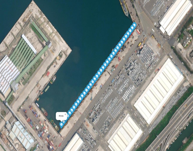
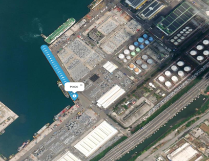
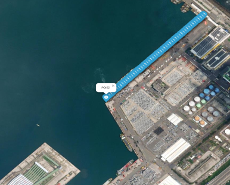
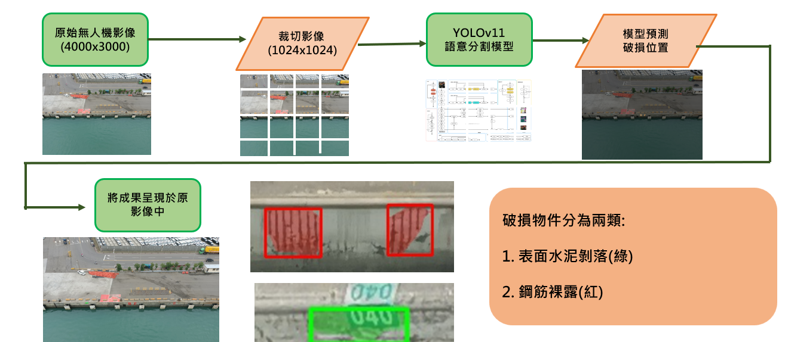
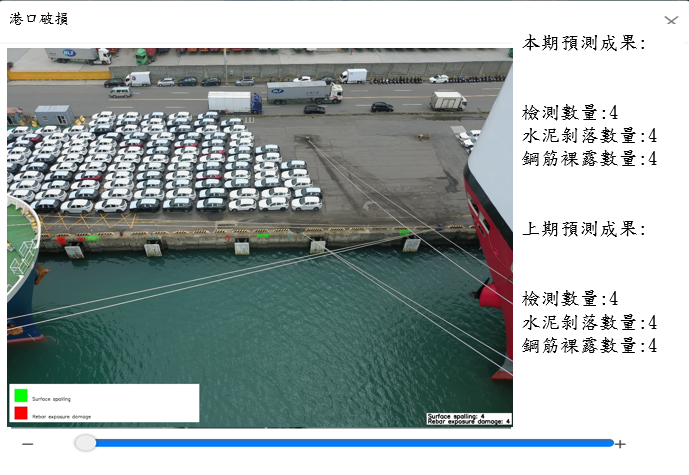

# Port Structure Damage Detection - 港口設施破損自動化檢測平台

本專案針對港口設施（如消波塊、胸牆等）影像，進行自動化**混凝土剝落**與**鋼筋裸露**損傷檢測。採用 UAV 拍攝高解析度影像，並利用 YOLOv8 語意分割模型實現破損辨識。全流程支援 GPU（CUDA 12.4），可一鍵部署。

---

## 🌊 平台功能特色

- 支援混凝土剝落（Surface spalling）、鋼筋裸露（Rebar exposure damage）兩類損傷自動檢測
- 支援 GPU 與 CPU 雙模式推論，兼容多種硬體環境
- 可批次處理多張港區設施影像
- 分割及標註結果自動儲存於 output 資料夾
- Docker 一鍵部署，復現環境零困難

---

## 📍 港區 POI 規劃示意

<div align="center">
    
</div>

- 與去年度港邊設施POI相同
---

## 🛠️ 工作流程

<div align="center">
  
</div>

本專案自動化港口結構破損檢測的處理流程如下：

1. **原始無人機影像獲取**  
   UAV 拍攝高解析度港口設施照片（建議解析度 4000x3000）。

2. **影像自動切割**  
   原圖分割為多張 1024x1024 小圖，適配深度學習模型。

3. **語意分割模型推論**  
   使用 YOLOv8 分割模型預測每塊子圖上的混凝土剝落（綠）與鋼筋裸露（紅）。

4. **合併與標註結果**  
   將子圖預測合併回原圖，並以

---

## 🏷️ 破損類別說明

- **表面水泥剝落 (Surface spalling)**：以綠色標註
- **鋼筋裸露 (Rebar exposure damage)**：以紅色標註

---

## 📊 成果範例

<div align="center">
  
</div>

---


## ⚙️ 部署說明（Docker + CUDA 12.4）

### 1. 下載專案檔案

```bash
git clone https://github.com/xc6571260/port_structure_detection.git
cd port_structure_detection
```
### 2. 拉取 CUDA 12.4 Docker image
```bash
docker pull nvidia/cuda:12.4.1-cudnn-devel-ubuntu22.04
```

### 3. 建立image
```bash
docker build -t port_structure .
```

### 4.1 執行 container（支援CUDA12.4）
```bash
docker run --gpus all -v D:/your_path/port_structure_detection/input:/app/input -v D:/your_path/port_structure_detection/output:/app/output port_structure
```
請將 D:/your_path/port_structure_detection/ 替換為你實際的本機專案路徑。

### 4.2 執行 container（CPU推論）
```bash
docker run -v D:/your_path/port_structure_detection/input:/app/input -v D:/your_path/port_structure_detection/output:/app/output port_structure
```
## 📂 目錄結構

```
input/        # 要檢測的原始影像
output/       # 推論及標註後的結果圖像
models/       # 預訓練模型檔案 (best.pt)
utils/        # 工具模組
fig/          # 說明及流程圖等圖片
Dockerfile    # Docker 設定
main.py       # 主程式
requirements.txt
README.md

```

---

## 📢 注意事項

- 若無 GPU/驅動，container 會自動 fallback 至 CPU（需程式支援）。
- 如需在其他路徑運行，請調整 `-v` 掛載參數。

---

## 📝 作者

- [xc6571260](https://github.com/xc6571260)

## 聯絡方式
- r12521801@ntu.edu.tw

