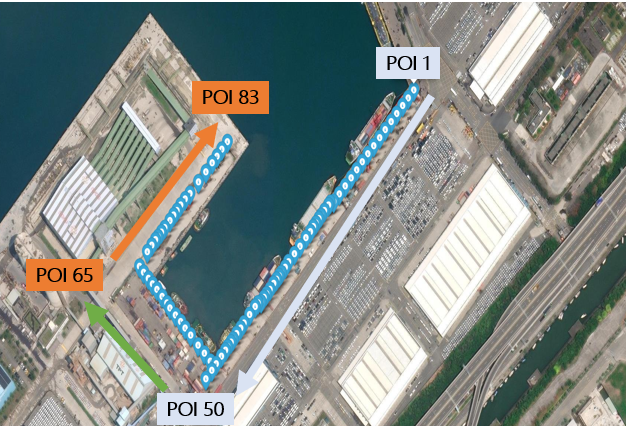
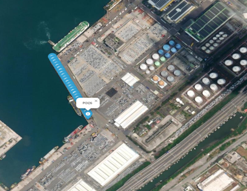
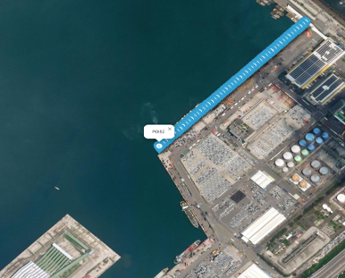
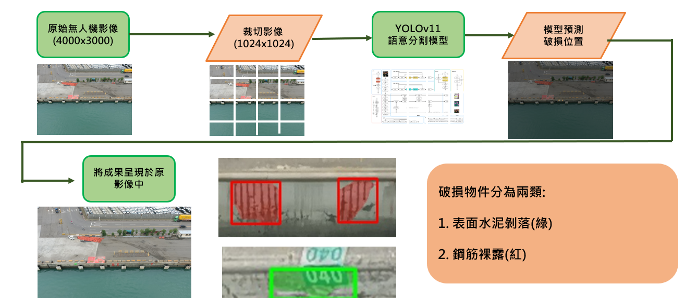
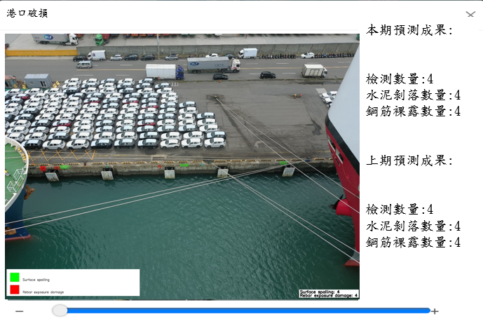

# Port Structure Damage Detection - 港口設施破損自動化檢測平台

本專案針對港口設施（如消波塊、胸牆等）影像，進行自動化**混凝土剝落**與**鋼筋裸露**損傷檢測。採用 UAV 拍攝高解析度影像，並利用 YOLOv11 語意分割模型實現破損辨識。全流程支援 GPU（CUDA 12.4），可一鍵部署。

---

## 📍 港區 POI 規劃

<div align="center">
    
</div>

- F1區為POI 1至50
- F2 F3區與先前一致
---

## 🛠️ 工作流程

<div align="center">
  
</div>

本專案自動化港口結構破損檢測的處理流程如下：

1. **原始無人機影像獲取**  
   UAV 拍攝高解析度港口設施照片（建議解析度 4000x3000）。

2. **影像自動切割**  
   原圖分割為多張 1024x1024 小圖，適配深度學習模型。

3. **語意分割模型推論**  
   使用 YOLOv11 分割模型預測每塊子圖上的混凝土剝落（綠）與鋼筋裸露（紅）。

4. **合併與標註結果**  
   將所有子圖的推論結果合併回原始大圖，並以不同顏色框標示各類破損，產生具備圖例與統計資訊的最終影像。

5. **成果儲存與數據輸出**  
  完成後自動將結果存入 output/ 資料夾，每張圖也會於終端顯示各類破損數量
（[INFO] image_name: MAX_0211.JPG  detection_number: 9  Surface spalling: 0  Rebar exposure damage: 9）。
---

## 🏷️ 破損類別說明

- **表面水泥剝落 (Surface spalling)**：以綠色標註
- **鋼筋裸露 (Rebar exposure damage)**：以紅色標註
- 當偵測到鋼筋裸露時，該圖像對應的POI點為紅色，其餘為綠色

---

## 📊 成果範例

<div align="center">
  
</div>

---


## ⚙️ 部署說明（Docker + CUDA 12.4）

### 1. 下載專案檔案

```bash
git clone https://github.com/xc6571260/port_structure_detection.git
cd port_structure_detection
```
### 2. 拉取 CUDA 12.4 Docker image
```bash
docker pull nvidia/cuda:12.4.1-cudnn-devel-ubuntu22.04
```

### 3. 建立image
```bash
docker build -t port_structure .
```

### 4.1 執行 container（支援CUDA12.4）
```bash
docker run --gpus all -v D:/your_path/port_structure_detection/input:/app/input -v D:/your_path/port_structure_detection/output:/app/output port_structure
```
請將 D:/your_path/port_structure_detection/ 替換為你實際的本機專案路徑。

### 4.2 執行 container（CPU推論）
```bash
docker run -v D:/your_path/port_structure_detection/input:/app/input -v D:/your_path/port_structure_detection/output:/app/output port_structure
```
## 📂 目錄結構

```
input/        # 要檢測的原始影像
output/       # 推論及標註後的結果圖像
models/       # 預訓練模型檔案 (best.pt)
utils/        # 工具模組
fig/          # 說明及流程圖等圖片
Dockerfile    # Docker 設定
main.py       # 主程式
requirements.txt
README.md

```

---

## 📢 注意事項

- 若無 GPU/驅動，container 會自動 fallback 至 CPU（需程式支援）。
- 如需在其他路徑運行，請調整 `-v` 掛載參數。

---

## 📝 作者

- [xc6571260](https://github.com/xc6571260)

## 聯絡方式
- r12521801@ntu.edu.tw

